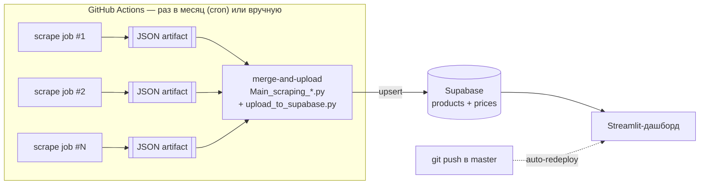

# Playbook: месячный пайплайн скрапинга → Supabase → дашборд

Живой справочник по архитектуре, обкатанной на Scraping_Belarus_v2 (сентябрь 2026).
Написан, чтобы служить основой при запуске аналогичных проектов (Казахстан, Россия,
любой следующий сайт-источник) — большинство паттернов здесь общие, специфика
конкретного проекта (валюта, поля, число источников) вынесена отдельно.

Каждый пункт ниже — не теория, а реальная проблема, с которой мы столкнулись при
первых прогонах в GitHub Actions, и конкретное решение. Если в новом проекте
всплывёт что-то из списка «Симптомы и что за ними стоит» — не гадать заново,
искать здесь.

---

## 1. Архитектура целиком



Ключевые свойства:
- Каждый источник — **отдельный job** с `continue-on-error: true`: один заблокированный
  сайт не топит остальные и не блокирует загрузку в БД.
- `merge-and-upload` запускается всегда (`if: always()`), даже если часть job'ов упала.
- Каждый job — **свежий checkout**: локальное состояние (JSON-файлы) между отдельными
  запусками workflow не сохраняется само по себе. Это важно для раздела 4.

---

## 2. GitHub Actions — структура workflow

### 2.1 Триггеры

```yaml
on:
  schedule:
    - cron: '0 3 1 * *'      # 1-е число месяца, 03:00 UTC
  workflow_dispatch:
    inputs:
      run_source_a:
        type: boolean
        default: true
      run_source_b:
        type: boolean
        default: true
```

`workflow_dispatch` с чекбоксами на каждый источник — чтобы точечно перезапустить
именно упавший источник, не гоняя всё заново.

GitHub **отключает** scheduled-trigger, если в репозитории 60 дней не было
активности (коммитов) — на активной разработке не страшно, но если проект надолго
«замрёт», cron придётся включить заново вручную на вкладке Actions.

### 2.2 Глобальный env

```yaml
env:
  PYTHON_VERSION: '3.11'
  PYTHONUNBUFFERED: '1'   # см. раздел 5.6 — иначе прогресс в логе виден рывками
```

### 2.3 Права

```yaml
permissions:
  contents: read
  actions: read   # нужно для action-download-artifact (см. раздел 4)
```

Дефолтный `GITHUB_TOKEN` без явного `permissions:` **не имеет** `actions: read` —
без него шаг восстановления артефактов из прошлого запуска (раздел 4) молча не
сработает.

### 2.4 Таймауты на каждый job

```yaml
jobs:
  scrape-source:
    timeout-minutes: 90   # requests-источники
    # Selenium-источники — обычно 120: медленнее и непредсказуемее
```

Жёсткий потолок GitHub-хостед раннера — **6 часов**, `timeout-minutes` его не
обходит, а лишь задаёт СВОЙ, более ранний потолок. Без этого один зависший job
(см. раздел 5.4 — «зависание», которого на самом деле не было) может тянуться
все 6 часов вместо того, чтобы упасть за разумное время и оставить время на
повторный запуск в тот же день.

---

## 3. Устойчивость скрапера — три уровня повтора

Один сбой ≠ повод сразу сдаваться, но и не повод ждать вечно. Рабочая связка —
**три независимых уровня**, каждый со своей задачей:

### Уровень 1 — внутри одного запроса (`get_with_retry`)

Ловит: обрыв соединения, таймаут, `429`, `5xx`.

```python
def get_with_retry(session, url, timeout=30, max_retries=8):
    for attempt in range(max_retries):
        try:
            r = session.get(url, timeout=timeout)
        except (requests.exceptions.ConnectionError, requests.exceptions.Timeout) as e:
            delay = min(2 ** attempt, 40) + random.uniform(0, 1)
            print(f'[retry {attempt+1}/{max_retries}] {type(e).__name__} на {url}, жду {delay:.0f}с')
            time.sleep(delay)
            continue

        if r.status_code == 429 or r.status_code >= 500:
            retry_after = r.headers.get('Retry-After')
            try:
                # КРИТИЧНО: даже уважая Retry-After, ограничивать сверху.
                # Сервер может прислать "3600" (час) — без потолка 8 попыток
                # растянутся на полдня, выглядя как "зависание" (раздел 5.4).
                delay = min(float(retry_after), 60) if retry_after else min(2 ** attempt, 40)
            except ValueError:
                delay = min(2 ** attempt, 40)  # Retry-After бывает и HTTP-датой
            print(f'[retry {attempt+1}/{max_retries}] HTTP {r.status_code} на {url}, жду {delay:.0f}с')
            time.sleep(delay + random.uniform(0, 1))
            continue

        r.raise_for_status()
        return r
    raise RuntimeError(f'Не удалось получить {url} за {max_retries} попыток')
```

**Печатать каждую попытку обязательно** — иначе ретраи молчат, и со стороны это
неотличимо от настоящего зависания (раздел 5.4).

### Уровень 2 — на одной карточке (несколько попыток подряд, короткая пауза)

Ловит то, что проходит МИМО уровня 1: сайт ответил `200`, но HTML не тот, что
ожидался (антибот подсунул другую страницу, временный глюк рендера) — это не
сетевая ошибка, `get_with_retry` тут не сработает, а без этого уровня карточка
уходит в сломанные с первой же попытки.

```python
CARD_RETRY_ATTEMPTS = 3
CARD_RETRY_PAUSE = 3.0

def fetch_card(session, line):
    result = None
    for attempt in range(1, CARD_RETRY_ATTEMPTS + 1):
        result = _fetch_card(session, line)   # реальная логика — один сетевой поход + парсинг
        if result[0]:  # success
            return result
        if attempt < CARD_RETRY_ATTEMPTS:
            time.sleep(CARD_RETRY_PAUSE)
    return result
```

### Уровень 3 — по всему списку (раунды после первого прохода)

После того как список карточек пройден один раз, оставшиеся сломанные пробуются
ещё раз — целыми раундами, с паузой между ними (дать сайту время «отпустить»):

```python
RETRY_ROUNDS = 3
ROUND_PAUSE = 45

for round_num in range(1, RETRY_ROUNDS + 1):
    if not break_line:
        break
    time.sleep(ROUND_PAUSE)
    still_broken = []
    for line in break_line:
        success, result, reason = fetch_card(session, line)
        if success:
            data_dict.append(result)
        else:
            still_broken.append(result)
    break_line = still_broken
```

### Не глотать причину сбоя

Голый `except: return False, line` не даёт понять, что происходит — 429 это,
403, обрыв связи или баг парсинга выглядят одинаково в логе. Возвращать причину:

```python
def fetch_card(session, line):
    try:
        q = get_with_retry(session, line)
    except requests.exceptions.HTTPError as e:
        return False, line, f'HTTP {e.response.status_code} (запрос)'
    except Exception as e:
        return False, line, f'{type(e).__name__} (запрос)'
    try:
        ...
        return True, data, None
    except Exception as e:
        return False, line, f'{type(e).__name__} (парсинг, status={q.status_code})'
```

В конце — сводка по причинам (`Counter`), а не просто число сломанных:
```
Сломанных ссылок: 12 | Причины: {'HTTP 429 (запрос)': 8, 'AttributeError (парсинг, status=200)': 4}
```
Эта строка экономит целый раунд переписки в духе «а что там на самом деле
происходит?».

### Параллелизм — начинать с малого, наблюдать за эскалацией блокировки

Сайты защищаются от скрапинга **эскалирующе**: сначала мягкий `429`, при
продолжении нагрузки — жёсткий обрыв TCP-соединения (`Connection refused`).
Если после снижения параллелизма `429` не проходит за несколько раундов повтора —
это уже не про число одновременных соединений, а про общий бюджет запросов в
единицу времени с IP. Тогда решение — не больше потоков, а меньше:
`MAX_WORKERS = 1` (последовательно) + фиксированная пауза между запросами
(`REQUEST_DELAY = 1.0` в `finally` вокруг каждого похода за карточкой). Считать
время — у большинства каталогов в тысячи карточек это всё равно укладывается в
разумные десятки минут даже без конкурентности.

---

## 4. До-заливка в течение месяца (не терять уже собранное)

Проблема: каждый job — свежий checkout, поэтому «пропускать уже готовое» между
**разными запусками** workflow само по себе не работает — файл с результатами
живёт только в рамках одного job'а.

Решение — восстанавливать `data_*.json` из артефакта **предыдущего** запуска
workflow (не текущего — обычный `actions/download-artifact` видит только
артефакты своего же запуска, нужен сторонний action):

```yaml
- name: Restore previous run's partial results (top-up within the same month)
  uses: dawidd6/action-download-artifact@v24
  continue-on-error: true
  with:
    github_token: ${{ secrets.GITHUB_TOKEN }}
    workflow: monthly-scrape.yml
    workflow_conclusion: ''       # любой, не только success
    name: data-source-a
    path: source_a
    if_no_artifact_found: warn    # первый прогон месяца — восстанавливать нечего, это ОК
```

Дальше уже существующая в скрапере логика делает всё сама:
```python
if result_path.exists():
    with open(result_path) as f:
        data_dict = json.load(f)
    already_done = {r['url'] for r in data_dict}
else:
    data_dict, already_done = [], set()

to_fetch = [url for url in all_urls if url not in already_done]
```

**Самокорректирующееся свойство**: если имя файла результата привязано к месяцу
(`data_08.2026_source.json`), то восстанавливать в начале **нового** месяца
нечего — шаг просто ничего не находит, скрапинг стартует с нуля, как и должно
быть. Работает только в рамках повторных запусков **внутри одного месяца**.

---

## 5. Симптомы и что за ними стоит (troubleshooting)

### 5.1 Устаревший CSS-селектор после редеплоя сайта

**Симптом:** страница листинга парсится (счётчик страниц/пагинация нормальный),
но карточек товара находится 0 — при этом раньше всё работало.

**Причина:** хэшированный CSS-модуль-класс (`ProductCard_product__jsAgo`,
`ListingProduct_product__WBPsd` — суффикс меняется при каждой пересборке
фронтенда сайта) больше не существует после редеплоя.

**Фикс:** сверить реальный текущий HTML (`curl` + поиск по `data-testid`), взять
актуальный класс. Ещё лучше — **предпочитать `data-testid` хэшированным
классам вообще**, где это возможно: `data-testid` в React/Next.js-приложениях
обычно стабильнее между сборками, чем сгенерированные CSS-module имена.

### 5.2 `UnboundLocalError` при неполном извлечении опциональных полей

**Симптом:** сбой парсинга детерминированный — повторяется на каждой из
нескольких попыток одинаково (в отличие от сетевых ошибок).

**Причина:** переменная присваивалась только внутри `if`-веток цикла, а
`except` со значением по умолчанию срабатывает только если весь блок бросил
исключение — если блок найден, но ни одно условие внутри не совпало (частичные
данные на странице), переменная остаётся неприсвоенной.

```python
# ПЛОХО — переменные определены только в happy path и в except
try:
    for row in rows:
        if 'X' in row.text: field_x = row.text
except:
    field_x = 'нет данных'
# ...используем field_x ниже — упадёт, если try прошёл, но 'X' нигде не встретилось

# ХОРОШО — дефолт ДО try, try только перезаписывает то, что реально нашёл
field_x = 'нет данных'
try:
    for row in rows:
        if 'X' in row.text: field_x = row.text
except:
    pass
```

### 5.3 `RLS 42501` при загрузке (`row-level security policy`)

**Симптом:** `upsert` падает с `new row violates row-level security policy`.

**Причина:** ключ Supabase, которым грузит серверный пайплайн, — тот же `anon`,
что у публичного дашборда (там RLS специально разрешает только `SELECT`).

**Фикс:** для серверной загрузки — **отдельный** ключ `service_role` (или новый
формат `secret`, `sb_secret_...`), который обходит RLS. Никогда не давать его
клиентскому/дашборд-коду. Две разные переменные окружения, не одна:
`SUPABASE_KEY` (anon, для чтения) и `SUPABASE_SERVICE_KEY` (service_role, для
записи) — так их физически нельзя перепутать местами по имени.

### 5.4 «Зависло на часы» — почти всегда не зависание

Три реальные причины, которые выглядят как зависание, но им не являются:

1. **Буферизация stdout.** Python буферизует вывод блоками, когда stdout не
   терминал (всегда так в CI) — `print()` может не долетать до лога, пока буфер
   не заполнится или процесс не завершится. Фикс: `PYTHONUNBUFFERED: '1'` в
   `env:` workflow (раздел 2.2).
2. **`Retry-After` без потолка.** См. раздел 3, уровень 1 — сервер может
   попросить подождать час, и без ограничения сверху 8 попыток растянутся на
   полдня, ничего не печатая между ними.
3. **Ретраи молчат.** Если внутренний retry-цикл не печатает прогресс — со
   стороны 8 минут внутренних попыток на первом же запросе неотличимы от
   зависания. Фикс — печатать каждую попытку (раздел 3).

Если после всех трёх фиксов лог реально пустой и не растёт много часов — тогда
уже стоит разбираться отдельно (сеть раннера, DNS и т.п.), но это редкость.

### 5.5 ChromeDriver не той версии (`SessionNotCreatedException`)

**Симптом:** `This version of ChromeDriver only supports Chrome version N,
Current browser version is N-1` (или наоборот).

**Причина:** `undetected-chromedriver` сам решает, какой ChromeDriver скачать,
и в CI этот выбор может не совпасть с тем, что реально установлено — особенно
если Chrome и ChromeDriver приходят из разных источников/каналов.

**Фикс:** не полагаться на автовыбор версии внутри `uc.Chrome()`. Использовать
`browser-actions/setup-chrome@v2` с `install-chromedriver: true` — эта экшена
ставит Chrome и ChromeDriver **одним шагом, из одной сборки**, гарантированно
совпадающие версии — и передать оба явно:

```yaml
- uses: browser-actions/setup-chrome@v2
  id: setup-chrome
  with:
    chrome-version: stable
    install-chromedriver: true
```
```python
driver_path = os.environ.get("CHROMEDRIVER_PATH")   # steps.setup-chrome.outputs.chromedriver-path
browser_path = os.environ.get("CHROME_PATH")         # steps.setup-chrome.outputs.chrome-path
return uc.Chrome(options=opts, driver_executable_path=driver_path, browser_executable_path=browser_path)
```

### 5.6 Прогон отменили вручную, «показалось, что не идёт»

Почти всегда — сочетание 5.4.1 и 5.4.3: буферизованный и/или молчащий retry-цикл
на самом первом запросе (даже до первой строки `print` в скрипте). Фикс —
раздел 5.4 целиком плюс печать retry-попыток. После фикса «завис или просто
медленно» становится видно прямо в логе, не нужно гадать.

---

## 6. Модель данных: гранулярность под реальное использование

**Правило:** гранулярность первичного ключа `prices`-подобной таблицы должна
совпадать с тем, как данные РЕАЛЬНО группируются в дашборде — не мельче
«на всякий случай».

Мы завели `price_id = product_id + дата + время` (до минуты), а дашборд группирует
всё **только по месяцу** (`period_label = date.strftime("%m.%Y")`). Итог:
до-заливка в течение месяца (раздел 4) создавала вторую запись цены за тот же
месяц вместо обновления существующей — и упиралась в БД-ограничение
`UNIQUE(product_id, date)`, которое кто-то раньше уже поставил, предвидя именно
эту проблему, но код его не учитывал.

**Фикс:** `price_id = product_id + MM.YYYY`. Повторный скрапинг того же товара
в течение того же месяца — `upsert` **обновляет** ту же строку (актуальная цена
побеждает), а не плодит вторую. Прошлые месяцы не трогает — у них свой
`price_id` с другим MM.YYYY, история между месяцами не теряется.

Тот же принцип держит в голове и локальный merge-скрипт: при коллизии по
первичному ключу — **свежие данные побеждают**, как и будет вести себя upsert
в БД. Если локальная логика вместо этого молча пропускает уже существующую
запись — локальный JSON-файл и то, что реально попадёт в базу, разойдутся.

---

## 7. Чеклист запуска нового проекта (новая страна / новый источник)

1. Аудит источников: `requests`/`aiohttp` (просто) vs Selenium (нужен headless
   Chrome в CI, см. раздел 5.5, и выше риск блокировки — датацентровый IP
   GitHub Actions чаще ловит антибот, чем домашний/офисный).
2. Скопировать структуру workflow (разделы 1–2): по job на источник,
   `continue-on-error`, `timeout-minutes`, `PYTHONUNBUFFERED`, top-up
   restore-шаг (раздел 4).
3. В каждый скрапер — три уровня повтора + reason-tracking (раздел 3). Не
   начинать сразу с высокого параллелизма — с 1 потока плюс паузой, поднимать
   только если видно, что сайт это спокойно переносит.
4. Схема БД: `product_id` = стабильный хэш URL (upsert-идемпотентно по
   определению), `price_id` = `product_id + месяц` (раздел 6) — если только
   явно не нужна более частая история, тогда сознательно выбрать день/неделю
   и убедиться, что дашборд её реально использует.
5. Supabase: `SELECT`-only RLS-политика для `anon` (дашборд), отдельный
   `service_role`/`secret`-ключ только для серверной загрузки (раздел 5.3) —
   в GitHub Secrets **сразу** заводить как две разные переменные.
6. Прогнать приёмочный чеклист: ручной `workflow_dispatch`, artifacts
   появляются, в БД нет дублей после повторного запуска, симуляция сбоя одного
   источника не роняет остальные, до-заливка реально дотягивает недостающее
   в течение того же месяца.
