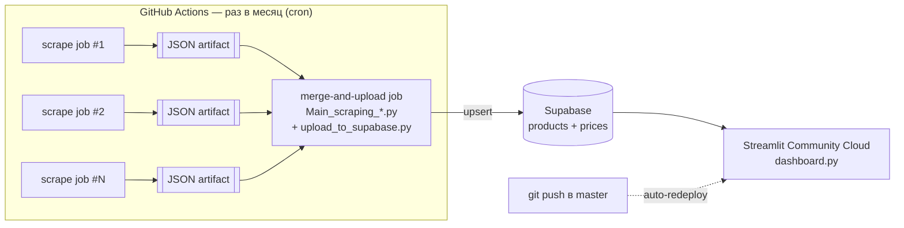

# Автоматизация парсинга и загрузки данных — план работ

**Дата:** 2026-08-22
**Пилотный проект:** Scraping_Belarus_v2
**Далее тиражируется на:** Scraping_Kazakhstan, Scraping_Russia
**Статус:** дизайн согласован для Беларуси, ожидает реализации

## 1. Зачем это делается

Сейчас весь цикл — запуск 3+ скриптов-парсеров, слияние, гармонизация, загрузка в Supabase — выполняется вручную раз в месяц с ноутбука. Задача: убрать ручной шаг. Парсеры должны запускаться сами по расписанию, данные — сами доезжать до Supabase, а дашборд — сам обновляться при каждом изменении кода в GitHub (Streamlit Community Cloud тянет `dashboard.py` из репозитория и передеплоивается на каждый push).

Подход обкатывается на Беларуси первой, потому что там всего 3 источника и наименьшая зависимость от Selenium. После того как пилот отработает 1–2 месячных цикла без ручного вмешательства, тот же playbook применяется к Казахстану и России.

## 2. Итоговая архитектура (везде одинаковая)



Ключевое свойство: каждый источник — отдельный job с `continue-on-error`, поэтому один заблокированный сайт не останавливает остальные и не блокирует загрузку в БД. `merge-and-upload` запускается всегда (`if: always()`), даже если часть job-ов упала.

## 3. Этап 0 — Беларусь (пилот)

### 3.1 Обзор источников

| Источник | Технология | Нужен headless Chrome в CI |
|---|---|---|
| 21vek (`21vek_request.py`) | `requests` | Нет |
| Altagamma (`Altagamma.py`) | `undetected-chromedriver` | **Да** |
| Modus Keramica (`Modus.py`) | `requests` | Нет |

Только Altagamma требует браузер — это делает Беларусь самым безопасным местом для первого запуска в CI.

### 3.2 Изменения в коде

1. **`Altagamma/Altagamma.py`** — добавить headless-режим, включающийся только в CI (`os.environ.get("CI")`), не трогая поведение на Windows-машине разработчика:
   ```python
   if os.environ.get("CI"):
       options.add_argument("--headless=new")
       options.add_argument("--no-sandbox")
       options.add_argument("--disable-dev-shm-usage")
   ```
2. `21vek_request.py`, `Modus.py`, `Main_scraping_Belarus.py`, `upload_to_supabase.py`, `dashboard.py` — без изменений. Они уже:
   - терпят отсутствующий JSON источника (просто пропускают его),
   - читают `SUPABASE_URL` / `SUPABASE_KEY` из переменных окружения или `st.secrets`, `.env` не обязателен.

### 3.3 Новый workflow `.github/workflows/monthly-scrape.yml`

- **Триггеры:** `schedule` (cron, 1-е число месяца) + `workflow_dispatch` с чекбоксами `run_21vek` / `run_altagamma` / `run_modus` (по умолчанию все `true`) — чтобы точечно перезапустить именно упавший источник.
- **Jobs:** `scrape-21vek`, `scrape-altagamma` (+ настройка Chrome), `scrape-modus` — каждый `continue-on-error: true`, каждый выгружает свой JSON как artifact.
- **`merge-and-upload`** (`needs: [...]`, `if: always()`): скачивает все доступные artifacts обратно в `21vek/`, `Altagamma/`, `Modus_Keramica/`, запускает `Main_scraping_Belarus.py`, затем `upload_to_supabase.py` (секреты — через `env:` из GitHub Secrets), публикует `products.json`/`prices.json` как artifact (retention 30 дней, для отладки).

### 3.4 Секреты и ручная настройка (один раз)

| Где | Что | Ключи |
|---|---|---|
| GitHub repo → Settings → Secrets | Для job `merge-and-upload` | `SUPABASE_URL`, `SUPABASE_KEY` |
| share.streamlit.io → New app | Подключить репозиторий `Scraping_Ceramic_Tiles_Belarus`, ветка `master`, путь `dashboard/dashboard.py` | — |
| share.streamlit.io → App settings → Secrets | TOML | `SUPABASE_URL`, `SUPABASE_KEY` |

После этого шага при каждом push в `master` дашборд передеплоивается сам — второй раз руками ничего не нажимается.

### 3.5 Хранение сырых данных

JSON-файлы источников остаются в `.gitignore` — не коммитятся в репозиторий (чтобы не раздувать git-историю). Вместо этого каждый прогон сохраняет их как GitHub Actions artifacts на 30 дней — достаточно, чтобы разобрать причину сбоя, но не накапливается вечно.

### 3.6 Уведомления об ошибках

Без дополнительной настройки — стандартный email от GitHub при падении job'а. Этого достаточно на пилоте; если окажется недостаточно (например, нужен Slack), добавляется отдельным шагом позже.

### 3.7 Приёмочный чеклист пилота

- [ ] Ручной запуск через `workflow_dispatch` — все 3 job проходят или падают штатно (не роняя весь workflow)
- [ ] Artifacts с JSON и с `products.json`/`prices.json` появляются в разделе Actions
- [ ] В Supabase нет дублей после повторного запуска (upsert действительно идемпотентен)
- [ ] Симуляция сбоя одного источника (временно сломать URL) → остальные два всё равно доезжают до Supabase, письмо от GitHub приходит
- [ ] Дашборд на Streamlit Cloud открывается и видит свежие данные без ручных действий
- [ ] Полный цикл проходит автоматически по `cron`-триггеру (не только вручную) — проверяется в следующем календарном месяце

## 4. Этап 1 — тиражирование на Казахстан и Россию

Тот же playbook (workflow с parallel scrape-jobs + merge-and-upload job + Streamlit Cloud auto-deploy), но с поправкой на состояние каждого проекта.

### 4.1 Сравнение проектов (проверено по коду на 2026-08-22)

| | **Беларусь** (пилот) | **Казахстан** | **Россия** |
|---|---|---|---|
| Источников | 3 | 5 | 4 |
| Из них на Selenium (нужен Chrome в CI) | 1 (Altagamma) | 1 (LemanaPRO_KZ) | **3 из 4** (LemanaPRO, Obi_selenium, Petrovich) |
| Git-репозиторий | ✅ есть, подключён к GitHub | ❌ **нет** — папка не инициализирована как git | ✅ есть, подключён к GitHub |
| `products.json`/`prices.json` → Supabase | ✅ есть pipeline | ✅ есть pipeline | ✅ есть pipeline |
| `dashboard.py` готов к Streamlit Cloud (`st.secrets` fallback) | ✅ | нужно проверить | нужно проверить |
| Валюта / диапазон цены | BYN, шаг 10 | KZT | RUB, шаг 100 |

### 4.2 Порядок: сначала Казахстан, потом Россия

**Казахстан — вторым**, потому что архитектурно он проще Беларуси (только 1 источник на Selenium из 5), но требует подготовительного шага: `git init`, создание репозитория на GitHub, первый push. Это ниже риска, чем Россия, и хорошая проверка, что playbook переносится на новый репозиторий с нуля, а не только «докручивается» в уже подключённом.

**Россия — третьей и с оговоркой.** 3 из 4 источников работают через `undetected-chromedriver`. GitHub Actions использует datacenter IP — сайты, защищённые от ботов, блокируют такие IP чаще, чем обычный домашний/офисный IP пилота. Это означает:
- Возможно, не все 3 selenium-источника стабильно отработают в CI с первого раза — понадобится диагностика по каждому отдельно.
- Стоит закладывать сценарий **гибридной схемы**: 1 источник без Selenium (KeramogranitRU) — в GitHub Actions по общей схеме, а 1–3 selenium-источника — оставить на локальном Windows Task Scheduler (как сейчас), с ручной или полуавтоматической выгрузкой JSON в тот же pipeline. Финальное решение принимается по факту тестового прогона Actions на реальных источниках России, а не заранее.

### 4.3 Общий playbook (применяется к каждому проекту)

1. Аудит источников: какие на `requests`/`aiohttp` (просто), какие на Selenium (нужен headless + возможен риск блокировки).
2. Если репозитория ещё нет на GitHub — создать, запушить текущий код (с уже настроенным `.gitignore` для JSON и `.env`).
3. Добавить headless-переключатель (`if os.environ.get("CI")`) в каждый selenium-скрапер этого проекта — по образцу правки в `Altagamma.py`.
4. Скопировать и адаptировать workflow-файл: имена job'ов, пути к папкам источников, имя merge-скрипта (`Main_scraping_Kazakhstan.py` / `Main_scraping_Russia...py`), имя upload-скрипта.
5. Завести `SUPABASE_URL`/`SUPABASE_KEY` в GitHub Secrets этого репозитория.
6. Подключить репозиторий к Streamlit Community Cloud, задать Secrets там же.
7. Прогнать приёмочный чеклист (аналогичный п. 3.7).
8. Для источников на Selenium — отдельно зафиксировать, стабильно ли они проходят в CI 2–3 прогона подряд; если нет — держать их на локальном Task Scheduler, не форсировать перенос в облако любой ценой.

## 5. Риски

| Риск | Где актуальнее | Смягчение |
|---|---|---|
| Antibot-блокировка datacenter IP GitHub Actions | Россия (3 Selenium-источника), в меньшей степени Казахстан/Беларусь (1 источник) | Гибридная схема: проблемный источник остаётся на локальном Task Scheduler |
| Частичный сбор за месяц (1 источник упал) | Все проекты | Уже заложено в дизайн: остальные источники всё равно доезжают до Supabase, упавший перезапускается вручную через `workflow_dispatch` |
| Рост репозитория | Не актуально | Сырые JSON не коммитятся, хранятся как artifacts 30 дней |
| Секреты Supabase утекут в лог | Все проекты | Секреты только через GitHub Secrets / Streamlit Secrets, никогда в коде или логах шагов |

## 6. Что дальше

1. Реализовать п. 3 (Беларусь) — после реализации это будет проверено через `writing-plans` skill как отдельный технический implementation-план с шагами и тестами.
2. Дать пилоту отработать минимум 1 полный месячный цикл по `cron`, не только вручную.
3. По итогам — повторить для Казахстана (п. 4.3), затем для России с поправкой на риск блокировки Selenium-источников.
